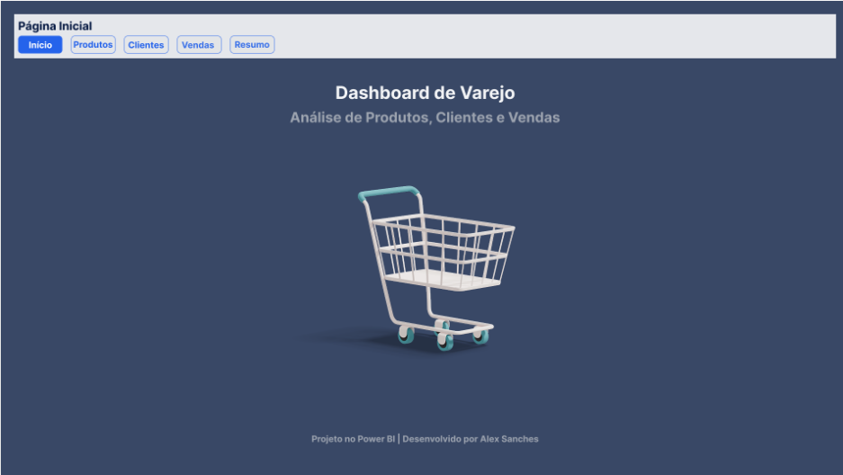
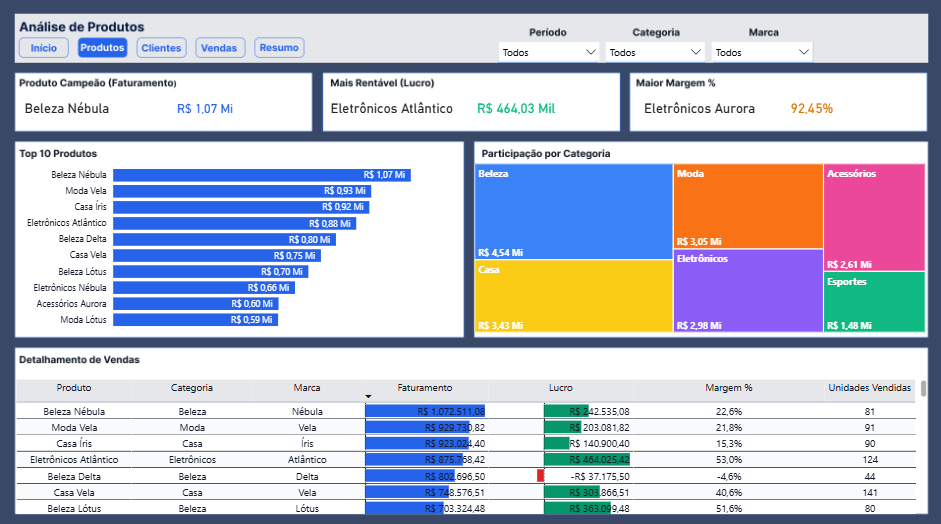
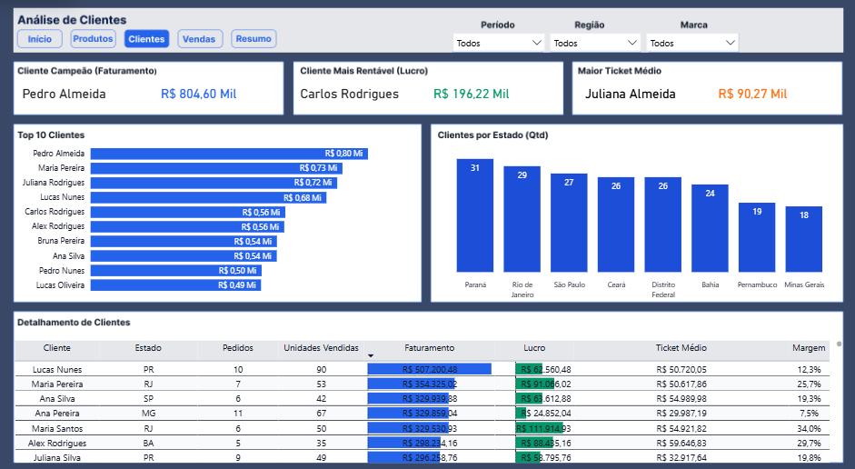
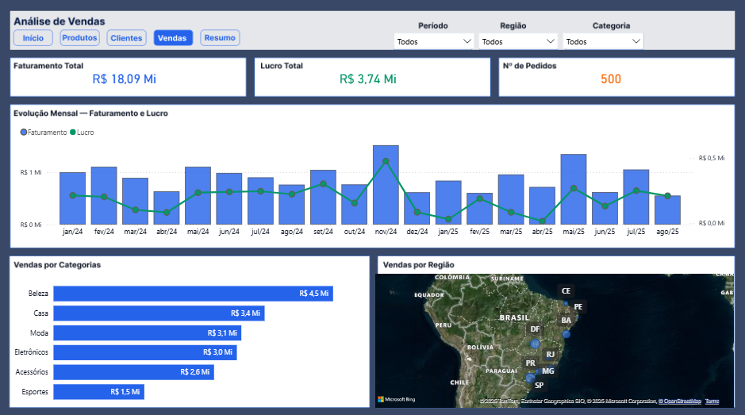
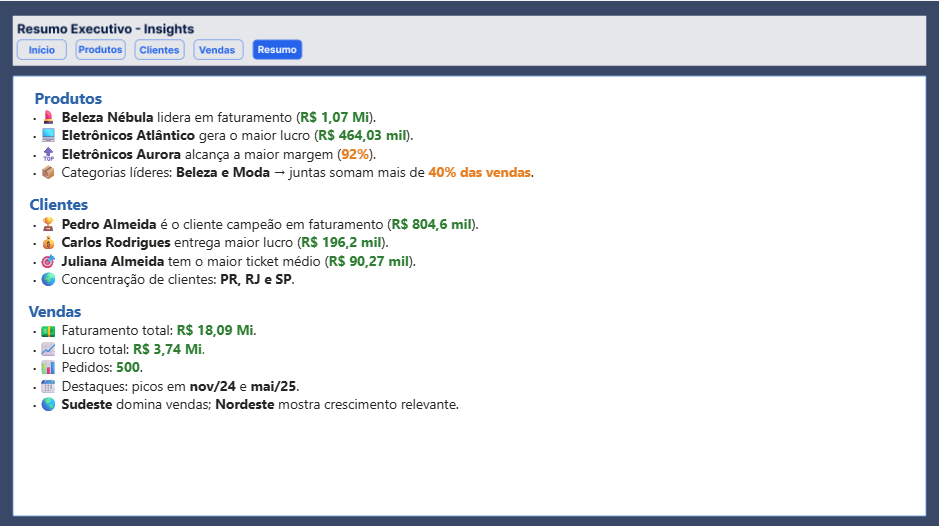

# 📊 Dashboard de Varejo

## 📸 Exemplo do Dashboard

Este projeto apresenta um **Dashboard de Análise de Vendas no Varejo** desenvolvido no **Power BI**, com foco em **produtos, clientes e desempenho de vendas**.

---

## 🚀 Objetivo
O objetivo é transformar dados de vendas em **informações estratégicas**, permitindo identificar produtos campeões, clientes mais rentáveis e tendências regionais.

---

## 📂 Estrutura do Dashboard
O dashboard foi dividido em **5 páginas** principais:

### 🔹 Página Inicial
- Navegação simples entre as seções do dashboard.
- Visão clara do escopo do projeto.  

---

### 🔹 Análise de Produtos
- **Produto campeão em faturamento:** Beleza Nébula (R$ 1,07M)  
- **Produto mais lucrativo:** Eletrônicos Atlântico (R$ 464K)  
- **Maior margem:** Eletrônicos Aurora (92%)  
- **Top 10 Produtos** e **participação por categoria**  

---

### 🔹 Análise de Clientes
- **Cliente campeão em faturamento:** Pedro Almeida (R$ 804K)  
- **Cliente mais rentável:** Carlos Rodrigues (R$ 196K)  
- **Maior ticket médio:** Juliana Almeida (R$ 90K)  
- **Top 10 Clientes** e **clientes por estado**  

---

### 🔹 Análise de Vendas
- **Faturamento total:** R$ 18,09M  
- **Lucro total:** R$ 3,74M  
- **Pedidos:** 500  
- **Evolução mensal de faturamento e lucro**  
- **Vendas por categoria e região**  

---

### 🔹 Resumo Executivo – Insights
- **Produtos:** Beleza e Moda representam juntas 40% das vendas.  
- **Clientes:** Concentração em PR, RJ e SP.  
- **Vendas:** Picos em Nov/24 e Mai/25.  
- **Regiões:** Sudeste domina vendas, Nordeste mostra crescimento.  

---

## 🛠️ Tecnologias Utilizadas
- **Power BI** → desenvolvimento do dashboard  
- **Excel/CSV** → base de dados de vendas  
- **Storytelling com Dados** → apresentação de insights  

---

## 👨‍💻 Autor
**Alex Sanches**  
[LinkedIn](https://linkedin.com/in/alexsanches-dados) | [GitHub](https://github.com/alexsanches-dados)
